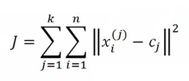
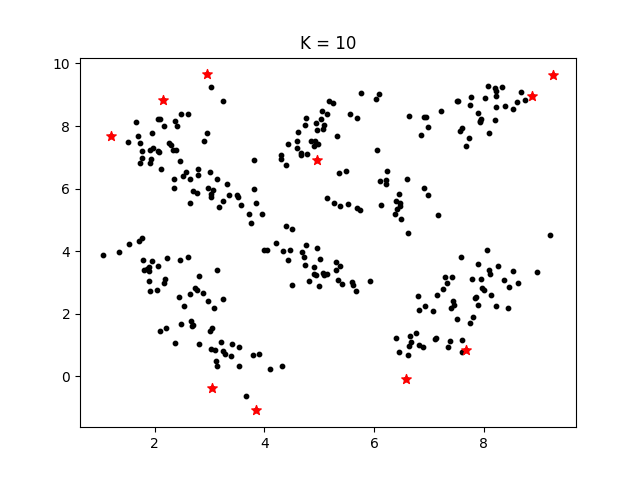
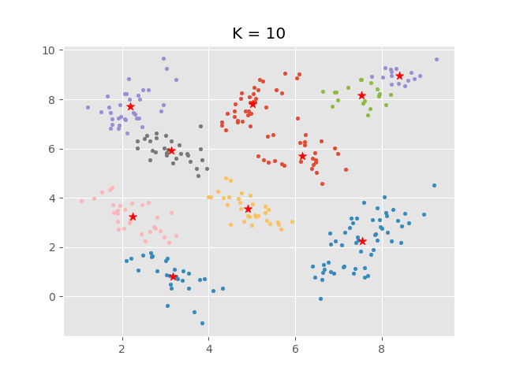
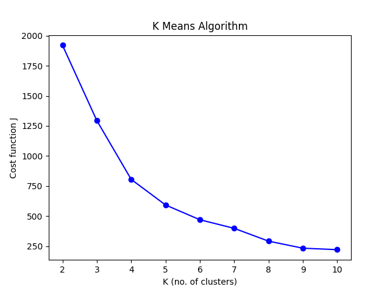

## K-Means Clustering

**Data Set:**

[Dataset](https://github.com/chxtio/CSE-575-Statistical-Machine-Learning/blob/master/Assignment%202-%20K-Means%20Clustering/AllSamples.npy)

The algorithm was applied on a data set of 300 2-D sample points.

**Implementation:**

The K-Means algorithm performs clustering on the given data with the number K of clusters ranging from 2-10.
The objective function as a function of k (k = 2, 3, …, 10) was computed as follows:

where k = number of clusters, n = number of cases, j = the index of cluster to which sample xi is currently assigned, and cj = centroid
of the cluster to which xi has been assigned.

**Strategies:** 
Two strategies were implemented for choosing the initial cluster centers.

Strategy 1: randomly pick the initial centers from the given samples.

Strategy 2: pick the first center randomly; for the i-th center (i>1), choose a sample (among all possible samples) such that the average
Euclidian distance of this chosen one to all previous (i-1) centers is maximal.

An example of strategy 2's initialization of centroids is illustrated for K = 10.

K = 10 
Initialization centroids
 [[ 4.95728696  6.90897984]
 [ 3.85212146 -1.08715226]
 [ 9.26998864  9.62492869]
 [ 1.20162248  7.68639714]
 [ 6.5807212  -0.0766824 ]
 [ 8.87578072  8.96092361]
 [ 3.04101702 -0.36138487]
 [ 2.95297924  9.65073899]
 [ 7.68097556  0.83542043]
 [ 2.14633887  8.83030888]]

**Results** 
The output of the K-Means algorithm for K = 10, strategy 2 is shown, followed by the final graph plot of the objective function w.r.t. all K values.

K = 10 
 Final centroids
[[6.15468228 5.70140721]
 [3.16906145 0.81432515]
 [8.41127011 8.97490383]
 [3.13834768 5.93372322]
 [4.91251497 3.56314096]
 [7.52197303 8.160704  ]
 [2.24204752 3.25100749]
 [5.0217766  7.82401258]
 [7.55616782 2.23516796]
 [2.18321462 7.70355341]] 
  Cost:
  220.1594892884666

